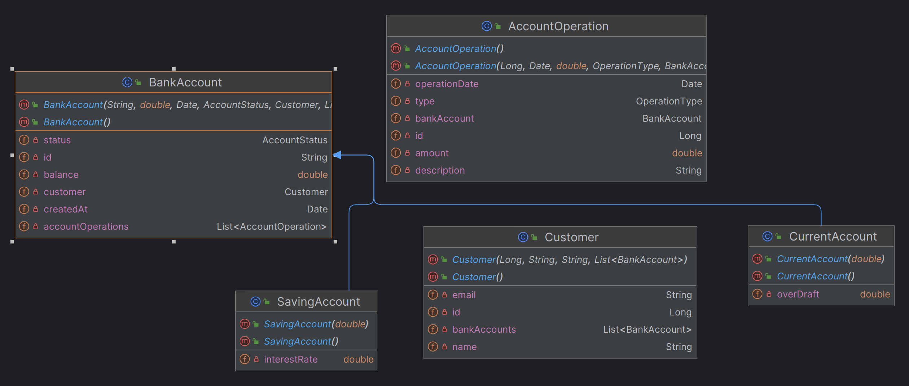
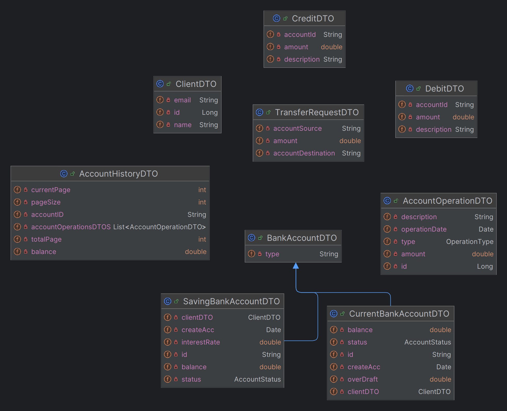
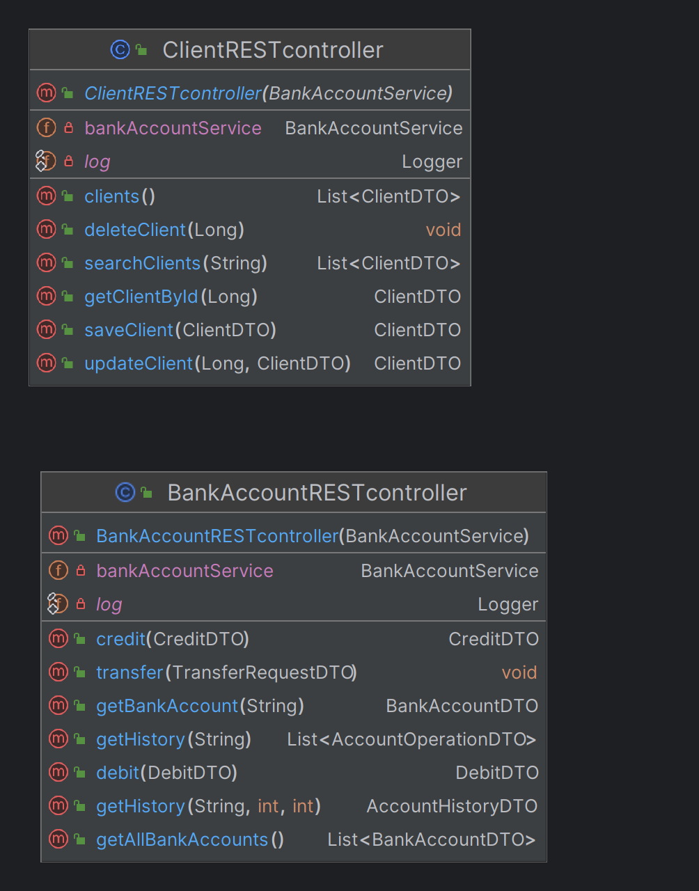
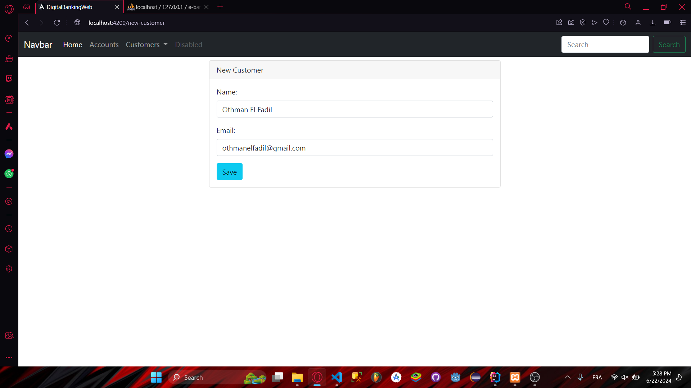
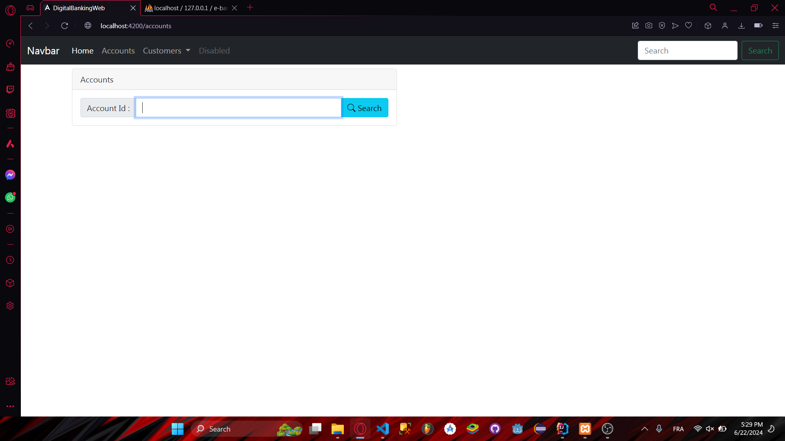
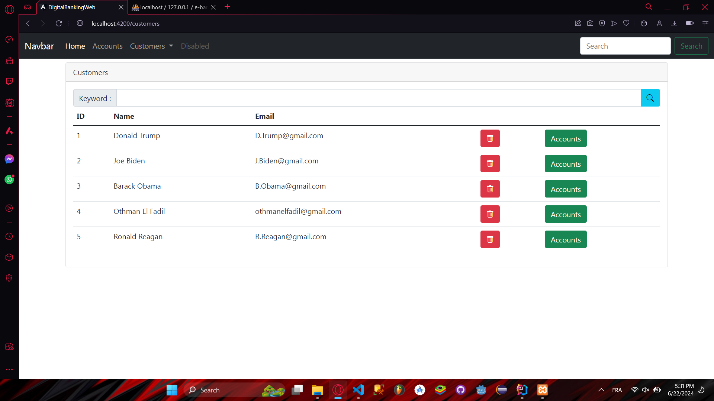
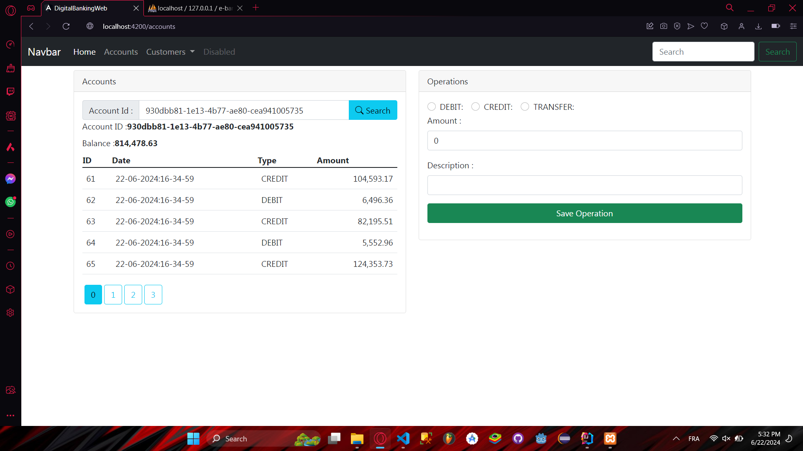

# Ebank_Spring

Ce projet est une application web de gestion des clients et de leurs comptes. Elle offre diverses fonctionnalités telles que les opérations CRUD sur les clients, la visualisation des comptes et des opérations, ainsi que l'exécution de transactions financières.

# 1-Ajouter Client/Customer

# 2-Rechercher Client
 

# 3-Listes Clients

# 4-Operation sur Compte

DTO est utilisé pour transférer les données d'historique de compte, y compris l'identifiant du compte, le solde, les détails de pagination et une liste d'opérations, entre différentes couches de l'application (par exemple, du service backend au contrôleur frontend).

Entité est utilisée pour représenter et persister les détails d'un compte dans la base de données. Elle contient des informations comme l'identifiant du compte, le solde et une liste d'opérations associées.

Contrôleur gère les requêtes HTTP pour les opérations CRUD (Create, Read, Update, Delete) sur les comptes bancaires. Il appelle les méthodes appropriées du service AccountService pour exécuter la logique métier correspondante.

La configuration Spring Security avec JWT permet une sécurité robuste basée sur des tokens, en garantissant que seuls les utilisateurs authentifiés et autorisés peuvent accéder aux ressources protégées.

Angular CLI est utilisé pour gérer efficacement et développer des applications Angular, en fournissant des commandes pour la génération de composants, services, modules, etc., ainsi que pour le lancement, la construction, les tests et le déploiement des applications.
